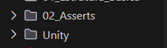

# 🧪 Instalação do Unity Test (C)

---

## 📌 Introdução

Para utilizarmos essa ferramenta, precisamos seguir alguns passos para que os testes funcionem corretamente.

⚠️ Esses passos podem não funcionar em todos os ambientes.

---

## 🔧 Método 1: Clonando o Repositório do Unity

### 📍 Passo 1: Clonar o repositório

Abra o terminal e execute:

```c
git clone https://github.com/ThrowTheSwitch/Unity.git
```

Isso irá criar uma pasta chamada `Unity` no seu projeto.



---

### 📍 Passo 2: Configurar o Makefile

Crie um arquivo chamado `Makefile` e adicione o seguinte conteúdo:

```makefile
CC = gcc
UNITY_SRC = ./Unity/src
CFLAGS = -I$(UNITY_SRC)


AULA = Treino
# Coloque aqui a Pasta onde está seus arquivos de teste e funções a serem testadas
ARQUIVO_COM_TESTES = TExercicio1
# Coloque o nome do arquivo que contém seus testes
ARQUIVO_COM_FUNCOES = Exercicio1.c
# Coloque o nome do arquivo que contém as funções

# CUIDADO COM OS ESPAÇOS DEPOIS DOS NOMES DAS VARIÁVEIS (vai por mim, passei 1 dia sofrendo só por causa de um erro de espaço)

all:
	$(CC) $(CFLAGS) $(UNITY_SRC)/unity.c $(AULA)/$(ARQUIVO_COM_TESTES).c $(AULA)/$(ARQUIVO_COM_FUNCOES) -o test.exe
	./test.exe

clean:
	del test.exe
```

---

## ▶️ Executando os testes

No terminal, execute:

```c
make
```

---

## ⚠️ Observações

* Sempre verifique o nome da pasta (`PASTA`)
* Sempre verifique o nome do arquivo (`ARQUIVO`)
* Ajuste os nomes conforme seu projeto

---

