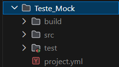
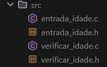
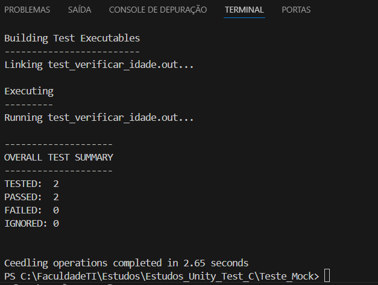

# 📘 Estrutura Básica — CMock

Agora que conseguimos configurar nosso ambiente, vamos aprender como utilizar a ferramenta **CMock**.

A seguir, haverá um exemplo didático para melhor compreensão.

**Bons estudos!!!** 🚀

---

## 🧪 EXEMPLO

Suponhamos que queremos fazer um programa que lê a idade do usuário.

* Caso seja **maior de idade**, retorna **TRUE (1)**
* Caso seja **menor de idade**, retorna **FALSE (0)**

---

## 🔹 1º Passo: Criando a pasta para o projeto

No terminal, utilize o Ceedling e digite:

```terminal
ceedling new Teste_Mock
```

Esse comando cria uma pasta chamada **Teste_Mock**.

Verifique que na sua aba de pastas vai aparecer algo assim.


---

### 📁 Explicação: o que significam essas pastas?

* **build** → onde ficam os mocks e arquivos gerados pelo Ceedling.

  > Na prática, normalmente você não irá mexer nela.

* **src** → onde ficará o seu código-fonte.

  > Aqui ficam as funções que queremos testar.

* **test** → onde ficarão os arquivos de teste.

  > É aqui que escrevemos os testes com Unity e CMock.

Já explicado, daremos continuidade ao nosso estudo.

---

## 🔹 2º Passo: Criando nossos arquivos dentro da `src`

Primeiro, criamos o arquivo que contém a função que iremos testar.

### 📄 `entrada_idade.c`

```c
#include <stdio.h>

int recebe_idade(){
    int idade;
    scanf("%d", &idade);
    return idade;
}
```

Agora criamos o arquivo que guardará o protótipo da função.

### 📄 `entrada_idade.h`

```c
int recebe_idade();
```

---

Agora criaremos o código-fonte que irá utilizar essa função.

Crie um arquivo chamado **`verificar_idade.c`**.

### 📄 `verificar_idade.c`

```c
#include <stdio.h>
#include "entrada_idade.h"

int testa_idade(){
    int idade = recebe_idade();
    if (idade >= 18){
        return 1;
    }
    else{
        return 0;
    }
}
```

Agora criamos o arquivo com o protótipo.

### 📄 `verificar_idade.h`

```c
int testa_idade();
```

---

Pronto, sua pasta `src` deve estar assim:



---

## 🔹 3º Passo: Criando os testes

Agora vamos ao principal: nossa pasta **test**.

Nela, criamos um arquivo chamado:

### 📄 `test_verificar_idade.c`

> ⚠️ Observação: todos os arquivos da pasta `test` devem começar com **`test_`**, para o compilador reconhecer.

```c
#include <unity.h>
#include "verificar_idade.h"
#include "mock_entrada_idade.h"

void setUp(void){}
void tearDown(void){}

void test_deve_retornar_falso_para_menor_de_idade(void){
    recebe_idade_ExpectAndReturn(15);

    int resultado = testa_idade();

    TEST_ASSERT_FALSE(resultado);
}

void test_deve_retornar_verdadeiro(void){
    recebe_idade_ExpectAndReturn(19);

    int resultado = testa_idade();

    TEST_ASSERT_TRUE(resultado);
}
```

---

## 🧠 Explicação do teste

### 🔹 Includes

```c
#include <unity.h>
```

Biblioteca principal de testes.

```c
#include "mock_entrada_idade.h"
```

Esse é o ponto principal do **CMock**.

Esse arquivo é gerado automaticamente.

Antes do primeiro teste ele ainda não existe, então é normal o VS Code reclamar.

---

### 🔹 Mockando a função

```c
recebe_idade_ExpectAndReturn(15);
```

Aqui estamos dizendo ao CMock:

> “Finja que a função `recebe_idade()` retornou 15”

Ou seja, ele **não executa o `scanf` real**.

Isso é extremamente útil para testar funções dependentes.

---

### 🔹 Validação

```c
TEST_ASSERT_FALSE(resultado);
```

Verifica se o resultado retornado é falso.

Como 15 é menor que 18, o teste deve passar.

---

## 🔹 4º Passo: Compilando os testes

Dentro da pasta **Teste_Mock**, rode:

```terminal
ceedling test:all
```

---

## ✅ Resultado esperado

No terminal, você verá algo semelhante a:



---

## 🎉 Parabéns

Se isso apareceu para você, parabéns!

Você conseguiu rodar seu **primeiro teste utilizando CMock**.

E talvez você tenha percebido algo muito importante:

* não existe `main`
* não usamos `make`

Esse é um dos grandes presentes do **Ceedling** 🎁

A partir de agora, ele será seu grande aliado para criar e executar testes.

---

## 🚀 Próximas aulas

Nas próximas aulas iremos aprofundar:

* mais funções do **CMock**
* recursos do **Ceedling**
* boas práticas de testes
* mocks mais complexos

**Bons estudos!!!**
